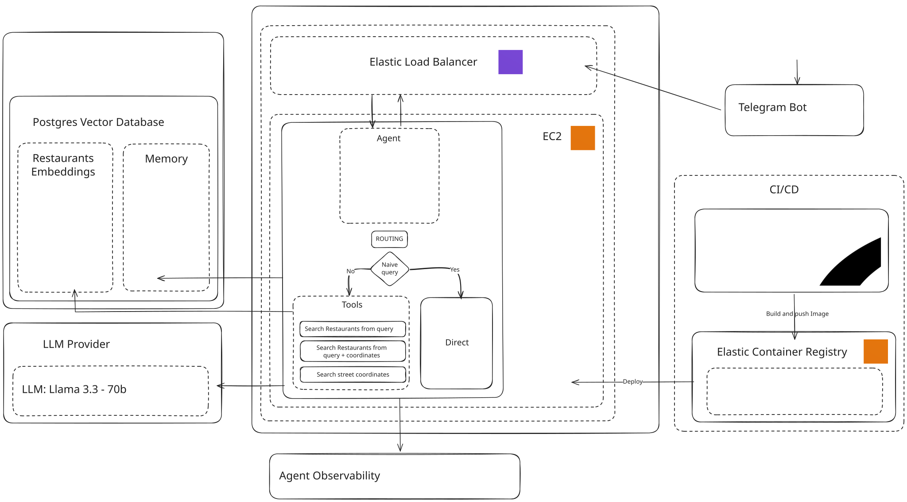

<p align="center">
        
    <h1 align="center">📱 Restaurants Recommender Agent 📱</h1>
    <h3 align="center"> Test the Agent<a href="https://t.me/AgenticAgent_bot"> here</a></h3>
</p>


<p align="center">
  
</p>


<p align="center">
  A sophisticated Telegram agent powered by a ReAct-based AI model. It leverages a vector database for efficient semantic search and is designed to be deployed on AWS. The agent can understand and respond to user queries, providing information about restaurants in Barcelona.
</p>

---

## Table of Contents
- [Project Overview](#project-overview)
- [Set up Project](#set-up-project)
  - [Prerequisites](#prerequisites)
  - [Local Development](#local-development)
  - [Docker Setup](#docker-setup)
- [Services](#services)
  - [Agent](#agent)
  - [Load Restaurants](#load-restaurants)
  - [Search Engine](#search-engine)
  - [Telegram Bot](#telegram-bot)
- [How it Works](#how-it-works)
- [Deployment - Infrastructure (AWS)](#deployment---infrastructure-aws)

---

## Project Overview

The Restaurants Agent is a conversational AI designed to provide information about restaurants. It uses a combination of a powerful language model (via Groq), a PostgreSQL vector database (PGVector), and a set of custom tools to understand and respond to user queries. The agent is exposed via a FastAPI application and includes a reference implementation for a Telegram Bot.

---

## Set up Project

This section will guide you through setting up the project for both local development and a containerized Docker environment.

### Prerequisites

Before you begin, you need to gather several API keys and credentials.

1.  **Clone the repository:**
    ```bash
    git clone https://github.com/your-username/whatsapp-agent.git
    cd whatsapp-agent
    ```

2.  **Create the Environment File:**
    Navigate to the agent service directory, copy the example environment file, and prepare to populate it.
    ```bash
    cd services/agent
    cp .env.example .env
    ```

3.  **Populate `.env` File:**
    Open the `.env` file with your favorite editor. You will need the following keys:

    -   `GROQ_API_KEY`: Get your API key from the [Groq Console](https://console.groq.com/docs/quickstart).
    -   `API_KEY_BOT_TELEGRAM`: Create a new bot and get the token from [@BotFather](https://t.me/botfather) on Telegram. [Instructions here](https://core.telegram.org/bots/tutorial#obtain-your-bot-token).
    -   `API_KEY_GOOGLE_MAPS`: Get a free API key from the [Google Maps Platform](https://developers.google.com/maps/documentation/embed/get-api-key).
    -   `API_KEY_GOOGLE_GENAI`: The agent uses Google's `text-embedding-004` model. Create your key from the [Google AI Studio](https://ai.google.dev/gemini-api/docs/api-key).
    -   `DATABASE_SERVICE_URL`: We recommend [Supabase](https://supabase.com) for a free, hosted PGVector database. Create a project and find your connection string under `Organization > Project > Connect`.
    -   `SECRET_TOKEN`: Generate a secure random string using a tool like the [IT Tools Token Generator](https://it-tools.tech/token-generator). This is used to secure the webhook between Telegram and the agent.
    -   **Observability:** To track the agent's performance, you can use Comet's Opik. Get your `API_KEY_OPIK`, `OPIK_WORKSPACE`, and `OPIK_PROJECT_NAME` from the [Comet Opik Docs](https://www.comet.com/docs/opik/quickstart).

    > **Note:** You can leave `TABLE_NAME`, `EMBEDDING_DIMENSIONS`, `TIME_PARTITION_INTERVAL`, and `OPENAI_API_KEY` with their default values for now.

### Local Development

This setup is ideal for contributing to the project's code.

1.  **Install `uv`:**
    We use `uv` for Python package management. Follow the official [installation instructions](https://docs.astral.sh/uv/getting-started/installation/).

2.  **Install Dependencies:**
    From the `services/agent` directory, create a virtual environment and install the required packages.
    ```bash
    # In services/agent/
    uv venv
    uv sync
    ```

3.  **Run the Agent:**
    Once the dependencies are installed and your `.env` file is configured, you can start the agent.
    ```bash
    # Make sure your virtual environment is activated
    source .venv/bin/activate 
    
    # Run the FastAPI server
    uvicorn api:app --host 0.0.0.0 --port 8000 --reload
    ```

### Docker Setup

This is the recommended way to run the entire application stack, including the database.

1.  **Ensure Prerequisites are Met:**
    Make sure you have cloned the repository and fully configured the `.env` file as described in the [Prerequisites](#prerequisites) section.

2.  **Start the Database:**
    This command starts a PostgreSQL container with the PGVector extension.
    ```bash
    docker-compose -f docker-compose/docker-compose-pgvector.yaml up -d
    ```

3.  **Build and Run the Agent:**
    This builds the agent's Docker image and runs it, connecting it to the environment variables.
    ```bash
    cd services/agent
    docker build -t restaurants-agent .
    docker run -p 80:80 --env-file .env restaurants-agent
    ```
---

## Services

### Agent
The core of the project is the `ReActAgent`, a custom implementation of the ReAct (Reasoning and Acting) framework. It processes user input, decides which tools to use, and generates a response.

-   **`api.py`**: A FastAPI application that exposes the agent's functionality via API endpoints.
-   **`react_agent.py`**: The `ReActAgent` implementation. It uses a language model for reasoning and its memory is connected to the PGVector database.
-   **`tools.py`**: Defines the tools the agent can use, such as searching for restaurants or getting coordinates.

### Load Restaurants
This service populates the vector database with restaurant information using the Google Maps API.

-   **`upload_place.py`**: Contains the main logic for fetching and processing data from the Google Maps API.
-   **`googlemaps_api.py`**: A wrapper for the Google Maps API.
-   **`place.py`**: Defines the `Place` data structure for restaurants.

### Search Engine
This service provides semantic and keyword search capabilities over the vector database.

-   **`vector_store.py`**: The `VectorStore` class, which provides a high-level interface for the PGVector database.
-   **`distance_coordinates.py`**: A utility for location-based searches.

### Telegram Bot
A reference implementation of a Telegram bot that interacts with the agent.

-   **`bot.py`**: The main logic for the Telegram bot, built with `aiogram`.
-   **`config.py`**: Handles configuration for the bot.

#### Setting the Telegram Webhook
To connect your bot to the running agent, you need to set a webhook.

-   **Set Webhook:**
    ```bash
    curl -X POST \
      -H "Content-Type: application/json" \
      -d '{"url": "YOUR_AGENT_ENDPOINT_URL", "secret_token": "YOUR_SECRET_TOKEN"}' \
      "https://api.telegram.org/bot<YOUR_TELEGRAM_TOKEN>/setWebhook"
    ```

-   **Delete Webhook:**
    ```bash
    curl -X POST "https://api.telegram.org/bot<YOUR_TELEGRAM_TOKEN>/deleteWebhook"
    ```

---

## How it Works
1.  A user sends a message to the Telegram bot.
2.  The bot forwards the message to the agent's API endpoint via the configured webhook.
3.  The `ReActAgent` receives the message, understands the user's intent, and decides which tool to use.
4.  If a restaurant search is needed, the agent queries the `search_engine` service.
5.  The `search_engine` performs a semantic search in the PGVector database and returns the most relevant results.
6.  The agent uses the results to formulate a helpful response and sends it back to the user via the Telegram API.

---

## Deployment - Infrastructure (AWS)
The project is designed for deployment on an AWS EC2 instance, optionally behind a Load Balancer. The included GitHub Actions workflow (`.github/workflows/deployment.yaml`) automates this process.

The CI/CD pipeline performs the following steps on a push to the `main` branch:
1.  Builds the agent's Docker image.
2.  Pushes the image to a private Amazon ECR repository.
3.  Connects to the target EC2 instance via SSH.
4.  Pulls the latest Docker image from ECR.
5.  Stops the old container and runs a new one with the updated image.

This agent is deployed! You can test it in https://t.me/AgenticAgent_bot