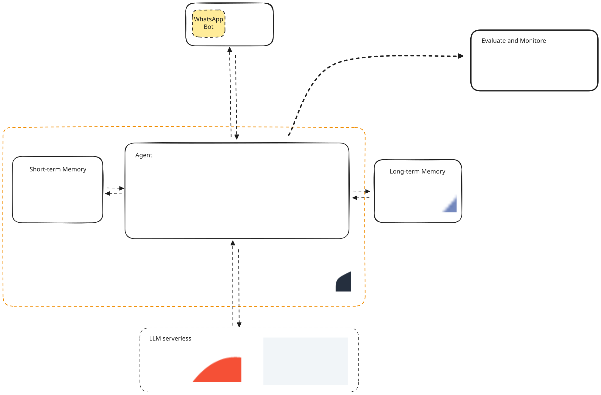

# WhatsApp Agent




### Llamaindex: building agents and multi-agent systems with AgentWorkflow in LlamaIndex

## To check ECS  Fargate scale to 0
[link](https://medium.com/qest/ecs-scale-to-zero-using-cloudfront-8b7dcb61b59b)


## Log in to aws ecr to Pull

**Disclaimer:** use sudo docker login instead of docker login to later pull the image (otherwise no permision is used).
aws ecr get-login-password --region eu-north-1 | sudo docker login --username AWS --password-stdin account_id.dkr.ecr.eu-north-1.amazonaws.com


## Log in to aws ecr to Pull

**Disclaimer:** use sudo docker login instead of docker login to later pull the image (otherwise no permision is used).
aws ecr get-login-password --region eu-north-1 | sudo docker login --username AWS --password-stdin .dkr.ecr.eu-north-1.amazonaws.com


docker pull .dkr.ecr.eu-north-1.amazonaws.com/telegram_agent:latest

## Enable/Disable Telegram WebHook

### Enable
```
curl -X POST "https://api.telegram.org/bot<TOKEN>/setWebhook" -d "url=endpoint"
```

```
curl -X POST "https://api.telegram.org/bot<TOKEN>/deleteWebhook"
```


## 1. Connect to EC2

```
ssh -i ~/.ssh (your .pem key) ec2-user@Public IPv4 address
```

### 2. install docker

```
sudo yum update
sudo yum install docker
```

Start the Docker service:
```
sudo systemctl start docker
```
Add the ec2-user to the docker group so that you can run Docker commands without using sudo:
```
sudo usermod -a -G docker ec2-user
```

### 3. Send files SSH

```
scp -i ~/.ssh/xxxx.pem .env ec2-user@xxx.xx.xx:.env
```

## Webhook example
```
{
  "resource": "/",
  "path": "/",
  "httpMethod": "POST",
  "body": "{\"update_id\": 800524573, \"message\": {\"message_id\": 800524573, \"from\": {\"id\": 800524573, \"is_bot\": false, \"first_name\": \"Test\"}, \"chat\": {\"id\": 800524573, \"type\": \"private\"}, \"date\": 1678886400, \"text\": \"hii\"}}",
  "isBase64Encoded": false
}
```
```
curl -X POST \             
     -H "Content-Type: application/json" \
     -d "$RESPONSE" \
     "$URL_TELEGRAM"
```

Test lambda image locally
```
curl -X POST http://localhost:9000/2015-03-31/functions/function/invocations -d ''
```

## TODO
modify pyproject in two env one for dev with test and extra dependencies other with just the production lib need.